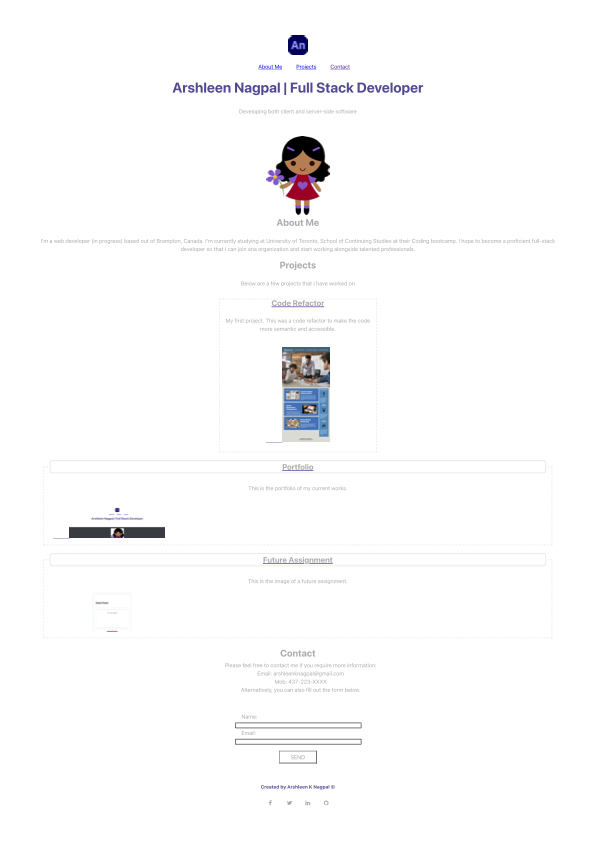

# 02 Portfolio

## Project Description

This is a portfolio of the projects that I have helped build. I have extensive experience in front-end web development and have worked in some applications where back-end development is required.

My portfolio has screenshots of the projects that I have worked on. 
The images link to the deployed applications. The titles of the projects are linked to the repos on GitHub.

## Screenshot

The following image shows my portfolio's appearance and functionality:

You can view the webpage is: <https://github.com/ArshleenKNagpal/portfolio-ver-2>

You can view the portfolio here: <https://arshleenknagpal.github.io/portfolio-ver-2/>

You can view the webpage is: <https://github.com/ArshleenKNagpal/portfolio-ver-2>
You can view the portfolio here: <https://arshleenknagpal.github.io/portfolio-ver-2/>
---
© 2021 Trilogy Education Services, LLC, a 2U, Inc. brand. Confidential and Proprietary. All Rights Reserved.

# portfolio
